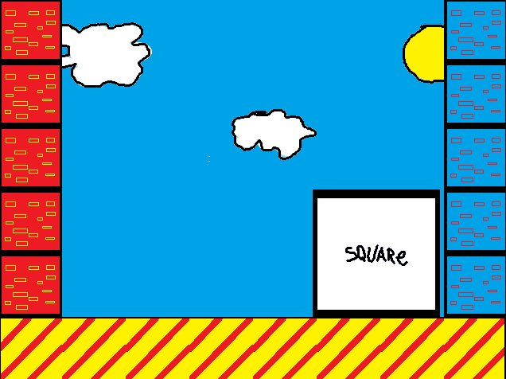

# 🎮 miyoo_square  

Минималистичный учебный проект по созданию игры для **Miyoo Mini+** на базе собственного игрового движка (со state-machine архитектурой) поверх **SDL2**.  

Полное описание и все базовые сведения - внутри [diary/about/about.md](https://github.com/dimakomplekt/miyoo_square/tree/main/diary/about/about.md)

---

## 🌍 Платформа и подход к разработке  

Проект разрабатывается и отлаживается **на Windows** (т.к. у меня Windows) для быстрой сборки и визуального тестирования.  

Для работы с исходниками тулчейна для Miyoo-mini использовался WSL.

При этом вся архитектура изначально строится так, чтобы игру можно было безболезненно перенести на **Linux-консоль Miyoo Mini**. 

Ключевые принципы:  

- кроссплатформенный **C++**;  
- графика через **SDL2**;  
- чёткое разделение логики игры и платформо-зависимого слоя;  
- собственый движок на базе иерархической **state machine** для управления состояниями приложения;
- часть графики на SDL-генерации, часть на ассетах.

Данные по подготовленному тулчейну - внутри [libs/engine/base_modules/Miyoo_toolchain/Miyoo_toolchain.md](https://github.com/dimakomplekt/miyoo_square/tree/main/libs/engine/base_modules/Miyoo_toolchain/Miyoo_toolchain.md)

Сборка проходила в 2 этапа:

1) Подготовка тулчейна.
2) Сборка проекта / сборка проекта с wifi-переносом на консоль

Для сборки использовались: пакет .sh / .ps1 макросов и cmake (всё лежит в корне). 

---

## ❓ Что это за игра  

Это очень простая экспериментальная игра, созданная **не ради геймплея, а ради архитектуры**.  

В ней:  

- Можно двигать квадрат влево и вправо.
- Когда квадрат достигает границы экрана — **меняются цвета всего, что есть в игре** (фон, элементы и сам квадрат).  

Это минимальный игровой цикл, на котором происходит: 

- работа state-машины в реальном времени;
- работа менеджера ассетов и инстансов;
- фоновая работа менеджера глобальной палитры цветов
- фоновая работа менеджера глобальной палитры шрифтов
- чтение ввода с кнопок;
- обновление состояния; 
- расчётный / запеченый рендер через SDL.

---

## 🧠 Смысл проекта  

С детства я мечтал сделать свою игру и сейчас у меня есть одна крутая идея, к реализации которой мне хотелось бы подготовиться.

Цели проекта:  

1. **Научиться делать собственный игровой движок поверх SDL2**  
   - понять, как правильно строить приложение;  
   - как связать SDL с игровой логикой;  
   - как организовать рендер, события и обновление состояний.  

2. **Освоить архитектуру приложения на основе state machine**  
   - чёткие состояния (меню, игра, пауза, выход и т.д.);  
   - чистые переходы между ними;  
   - понятная структура кода.  

3. **Научиться собирать и запускать программы под Linux-портативки**  
   - подготовка к портированию на **Miyoo Mini**;  
   - работа с кросс-компиляцией и зависимостями;  
   - понимание ограничений маленьких устройств.

---

## 🚧 Текущее состояние  

Проект завершен.

Его результаты можно будет дополнить расширением либ для работы со звуком и получить более-менее достойную заготовку игрового движка для платформеров. 